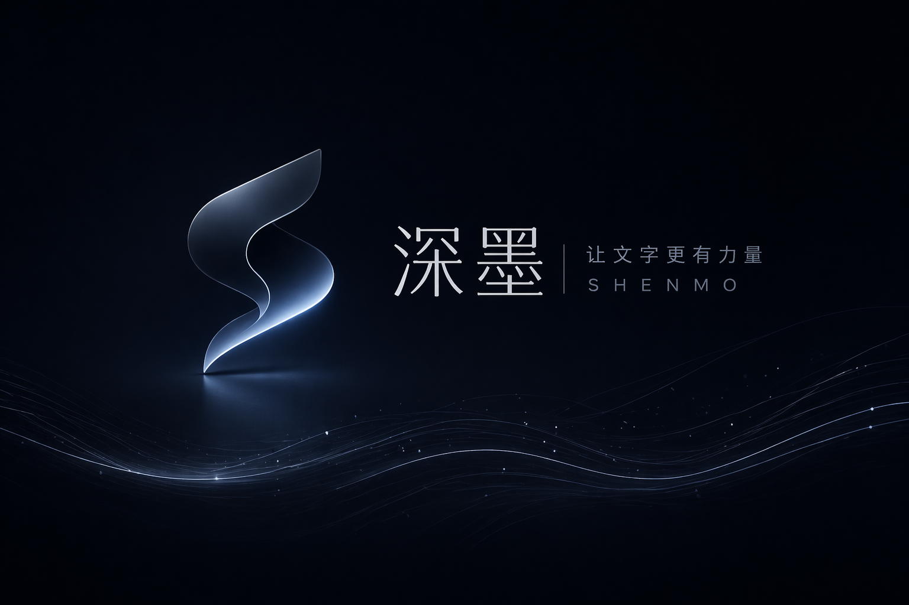
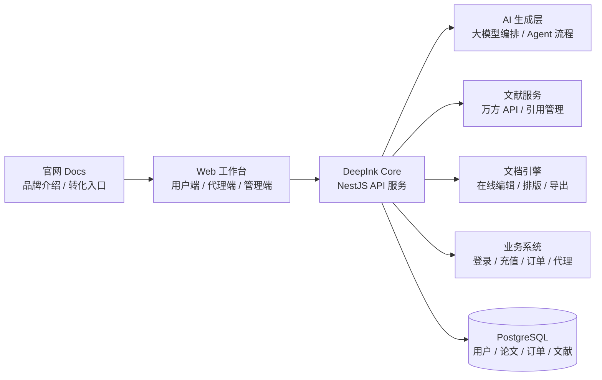

  

  

<h1 align="center">深墨 DeepInk</h1>

  面向论文写作场景的 AI 创作平台，从文献准备、提纲生成、段落写作、在线排版到 WPS/Word 导出，帮助用户更高效地完成结构化学术写作。

  
  
  
  
  

---

## 产品定位

深墨不是一个简单的聊天式生成工具，而是围绕“论文交付”设计的一套工作流系统。第一版本会优先打通用户真正需要的核心路径：登录注册、论文创作、万方文献插入、段落级生成、在线编辑排版、文档导出、AIGC 降重、充值计费与代理模式。

  

## 核心能力

| 模块 | 说明 |
| --- | --- |
| AI 论文写作 | 支持按论文主题、专业方向、字数、章节结构生成内容，并允许用户逐段编辑标题后再生成正文。 |
| 万方文献接入 | 对接万方文献 API，完成文献检索、选择、引用插入与参考文献管理。 |
| 在线编辑排版 | 提供接近 WPS/Word 的文档编辑体验，支持标题层级、正文格式、引用与排版规则调整。 |
| 文档导出 | 支持将论文结果导出为可继续编辑的 WPS/Word 文档。 |
| AIGC 降重 | 面向论文重复率与 AI 痕迹优化，提供段落级改写、语义保留与风格调整。 |
| 代理模式 | 支持代理账号、客户订单、余额/套餐、渠道收益与服务工单等业务能力。 |
| 充值与账户 | 支持用户套餐、点数余额、订单记录、消费明细与权限控制。 |

## 技术架构

## 技术栈

| 层级 | 技术选型 |
| --- | --- |
| 前端 Monorepo | Turborepo、pnpm、TypeScript |
| Web 工作台 | Next.js 16、React 19、Tailwind CSS、shadcn/radix-ui、React Hook Form、Zod、Motion |
| Docs 官网 | Next.js、品牌视觉资产、滚动动效与响应式页面 |
| 后端服务 | NestJS 11、TypeORM、PostgreSQL、class-validator、Jest |
| AI 能力 | 模型接入层、生成任务编排、论文段落生成、AIGC 改写、Agent 模式 |
| 文档能力 | 在线编辑、排版规则、文献引用、DOCX/WPS 导出 |

## 第一版优先级

- **P0：可上线闭环**：官网、登录注册、论文创建、AI 生成、在线编辑、文档导出。
- **P1：论文增强**：万方文献检索、引用插入、参考文献管理、AIGC 降重。
- **P2：商业化**：充值套餐、订单记录、消费明细、代理账户与代理客户管理。
- **P3：运营与服务**：工单系统、后台管理、用户权限、数据看板与异常追踪。

## 仓库入口

| 仓库 | 说明 |
| --- | --- |
| [DeepInk](https://github.com/DeepInk-AI/DeepInk) | 深墨前端 Monorepo，包含 Web 工作台与 Docs 官网。 |
| [DeepInk-Core](https://github.com/DeepInk-AI/DeepInk-Core) | 深墨后端服务，负责用户、论文、文献、AI 任务、计费与代理业务。 |

  

---

  <strong>Deep</strong> 代表深度学习，<strong>Ink</strong> 代表笔墨。深墨希望把 AI 能力真正落到论文创作的每一个步骤里。

